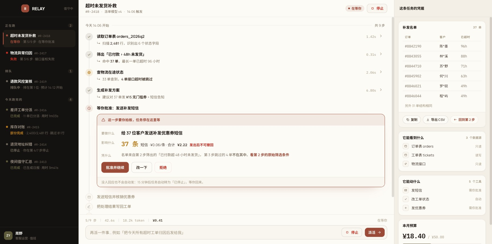
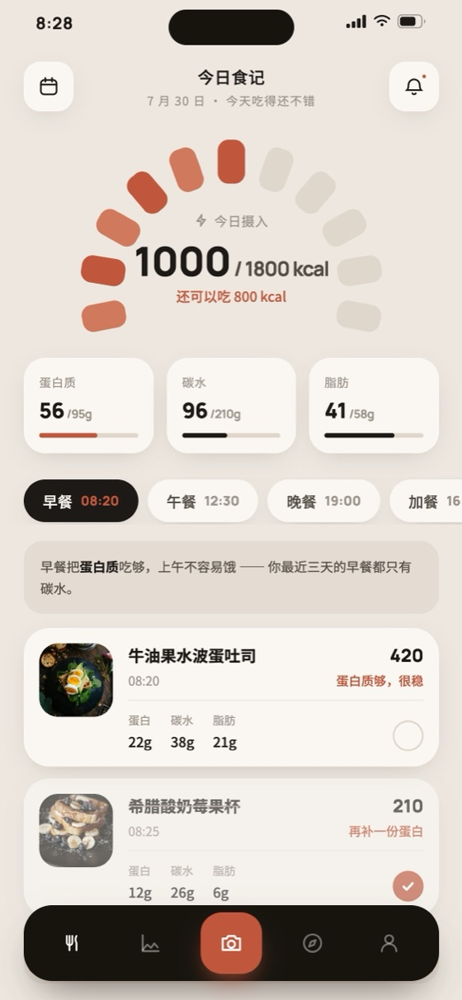
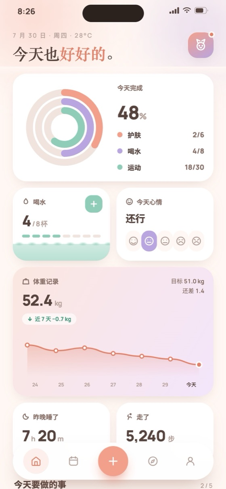
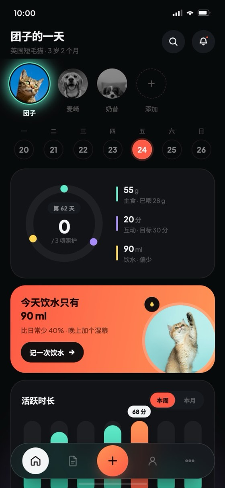
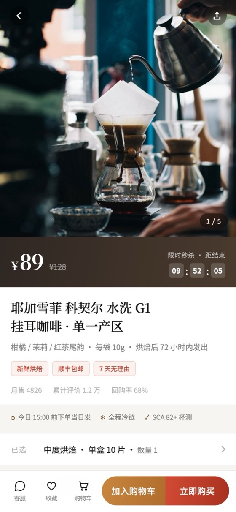

[中文](README.md) | [English](README.en.md)


<div align="center">

# finesse-skill

**Never-cheap interfaces — brand spectacle · product precision · native on phones**

A design skill for AI coding assistants. It doesn't produce pages that are "fine". It produces pages with a soul, with craft, that hold up when you look closely.

[](https://github.com/mouse-lin/finesse-skill/releases)
[](LICENSE)
[](skills/finesse-ui/references)
[](skills/finesse-ui/examples)

[Quick start](#quick-start) · [Four registers](#four-registers) · [What's inside](#whats-inside) · [Examples](#examples) · [Install](#installation--tool-support) · [Usage guide](USAGE.en.md)

</div>

---

## Quick start

```bash
npx skills add https://github.com/mouse-lin/finesse-skill
```

Then just talk to it:

> "Use finesse to build a landing page for a specialty coffee roaster"
> "Build a data dashboard for our ops team"
> "Design the UI for a budgeting app"

It **tells you what it's about to build first** — in words you can actually picture — and waits for your nod before writing any code.

> [!TIP]
> First time here, and no design background? Start with the **[usage guide](USAGE.en.md)** — how to brief it, how to veto it, how to iterate.

---

## Four registers

The same brief, routed differently, produces **genuinely different design languages**. finesse decides the register first, and everything else follows from it.

| Register | What it builds | Optimizes for | Core method |
|:---|:---|:---|:---|
| **brand**<br><sub>design IS the product</sub> | landing pages · brand sites · launches<br>portfolios · hero pages | spectacle + soul<br>first impression | pick a soul, build **one** real visual engine<br><sub>Three.js / GLSL / Canvas / WebGL / GSAP</sub> |
| **product**<br><sub>design SERVES the product</sub> | dashboards · admin · analytics<br>data tables · app shells · settings | clarity + density<br>usability | component system + data viz<br><sub>pick the palette first, or every dashboard comes out blue</sub> |
| **commerce**<br><sub>hybrid</sub> | PDP · listing · cart · checkout | conversion<br>without dark patterns | routed to one of the two above by what the page does<br><sub>selling one item leans brand, filtering many leans product</sub> |
| **h5**<br><sub>container register</sub> | H5 · phone-only pages · campaign pages<br>mini-program screens · app prototypes | how it feels in the hand | **nail the phone frame first**, then wrap one of the above<br><sub>a mobile PDP is h5 + commerce</sub> |

All four share the same foundation: **premium physical substrate + anti-slop audit**. Dashboards aren't allowed to look cheap, and neither are H5 pages.

<details>
<summary><b>How it actually runs (five steps)</b></summary>

<br>

1. **Read the brief** — first ask whether the page has a desktop form at all; if not, it's h5. Then split brand / product / commerce. Output a one-line Design Read to commit direction, then **stop and wait for you**.
2. **Set three dials** — SOUL (how distinct the personality is) · SPECTACLE (technical ambition, the signature dial) · DENSITY (information per screen). Product register pins SPECTACLE low, DENSITY high.
3. **Lay the substrate** — grain · vignette · type tension · translucent borders · OKLCH color lock. For h5, **the frame goes up first**, then the substrate of whichever register it wraps.
4. **Fork**
   - **brand** → pick a soul (industry → style persona) + build one hero engine, five types, **done at 100%** (not five half-built ones)
   - **product** → component system + data viz (information architecture · tables · charts · forms · full interaction-state inventory)
   - **h5** → pick one of six phone morphologies (app shell / paged deck / snap narrative / commerce stack / longform site / ambient screen) + build the native furniture from the recipes
5. **Anti-slop blacklist + pre-flight check**, then ship.

</details>

---

## What's inside

<table>
<tr>
<td width="50%" valign="top">

**Visual craft**

- **Premium physical substrate** — grain / vignette / type tension / color families<br><sub>distilled from a 53-page industry showcase corpus</sub>
- **Five hero engine types** — Three.js · Canvas · WebGL-FBO · GSAP · CSS-only, each with a reduced-motion fallback skeleton
- **3D effects spectrum** — CSS pseudo-3D (tilt / flip / coverflow / depth-parallax) + Three.js real 3D
- **OKLCH color ladder** — four commitment levels: restrained / committed / full / drenched

</td>
<td width="50%" valign="top">

**Decisions & guardrails**

- **Anti-sameness engine** — composes a soul from five orthogonal axes instead of picking off a list<br><sub>with a cross-run build log, so "don't repeat" can actually fire</sub>
- **Anti-slop blacklist** — production-verified AI tells + absolute bans + reflex-reject font/palette lists
- **Pre-flight check** — promise kept · cheapness scan · a11y · mobile floor
- **Local detector** — `detect.mjs` mechanically scans for slop and claimed-but-not-shipped spectacle

</td>
</tr>
<tr>
<td width="50%" valign="top">

**product route**

- Dashboard information architecture · six shell morphologies
- 25 chart types × a11y grade × library picks
- Hand-built chart implementation layer (zero-dependency SVG recipes)
- Data tables · forms · full interaction-state inventory
- **A product color library** — 5 tinted neutral ramps + 16 accents + 12 paste-ready sets
- **AI workbenches** (pages you delegate on) — three tenses on one screen · a run stream instead of a chart · nine run states · a resident stop · human-in-the-loop approval cards · cost as a receipt<br><sub>A dashboard fails by being unreadable and a wizard by being unfinishable; this one fails by being untrustworthy</sub>

</td>
<td width="50%" valign="top">

**h5 route**

- The viewport contract · the locked-`body` / scrolling-container **architecture inversion**
- 560px desktop phone frame · safe-area math
- **The thumb-zone inversion** — primary actions always at the bottom
- Touch rules (`passive` / `pointercancel` / tap-highlight / 44px)
- Six phone morphologies + native furniture recipes<br><sub>status bar · TabBar · bottom sheet · FAB · push and hand-written FLIP transitions</sub>

</td>
</tr>
</table>

---

## Examples

Built from the same design DNA, yet deliberately unrelated to each other — which is exactly what the anti-sameness engine is for.

<details open>
<summary><b>brand route</b> — visual engines · soul-driven · across industries</summary>

<br>

| | |
|:---:|:---:|
|  |  |
| **Nexus** · Three.js particle orbital rings | **Drift** · Canvas 2D flow-field particles |
|  |  |
| **Forge** · Three.js particle fire | **Volt** · bold typographic · EV |
|  |  |
| **Morning Ritual** · editorial light | **Eclipse** · data gravity platform |

</details>

<details>
<summary><b>product route</b> — component systems · data viz · six shell morphologies</summary>

<br>

| | |
|:---:|:---:|
|  |  |
| **Buildly** · canonical sidebar + area draw-in | **Pulsegrid** · glowing sparklines + custom slider |
|  |  |
| **ACRU** · light sidebar + tooltip bars | **PawCare+** · photo hotspots + theme switcher |
|  |  |
| **Nodeflux** · floating panel + true bento | **Inkline** · top-nav triptych + browser preview |
|  |  |
| **Huddle** · top-nav bento + multi-arc donut | **Threadline** · asymmetric bento + circular gauge |

</details>

<details open>
<summary><b>Workbench</b> —— revolves around one thing he does over and over: one species, two bodies</summary>

<br>

> **Tell 工作台 from 后台 first. It is the easiest thing in this skill to get wrong and the most expensive.**
>
> | | **后台 back-office** | **工作台 workbench** |
> |---|---|---|
> | Revolves around | a batch of business objects — N customers · orders · devices · tickets | **one thing he does over and over** — logging spend, standing watch, writing daily, clearing exceptions |
> | Why it's open | there's work to process: an order landed, an alert fired, a report is due | it's that time of day — check in, log one, close it out |
> | Who writes the data | systems, integrations, other people | **he does**, in seconds, and it must cost almost nothing |
> | Soul | **neutral by obligation** — it lives inside someone else's brand next to eleven other tools | **mandatory** — it's his, and a neutral one has no reason to be opened twice |
>
> **Neither head-count nor screen is the test.** A family sharing a budget desk and a team sharing a watch desk are both workbenches; one person running an inventory system is still a back-office. The screen only picks which body it wears —

**Body one · on a desktop**



**RELAY · order-exception desk** —— this one also carries a capability: **an agent doing the work for him.** That layer is orthogonal to the body (a phone workbench can carry it too) and what it adds isn't layout, it's *why you'd trust it*. A dashboard survives by being readable, a wizard by being finishable; **one with an agent survives by being trustworthy**:

| What's on screen | The question it answers |
|---|---|
| Rail in three sections: running · queued · finished today | three tenses at once — the whole picture without changing page |
| A **run stream** instead of a chart, 9 steps each with its own duration | *what is it doing right now* — not a spinner |
| The approval card **lives in the stream**: what it'll do / what it costs / **on what evidence, linked back to step 2** | *why did it decide that* |
| Aside: what it can see · what it can touch (read-only / read-write / needs approval) | permissions as a visible fact, not a line in a settings page |
| Receipt `42.6s · 18.2k token · ¥0.41` + a bounded monthly meter | *what is this costing me* — the bill shouldn't arrive at month end |
| **Stop** resident in two places | *how do I stop it* — closing the tab stops nothing |

Palette is `product-palettes.md` Set 7 wired to the semantic pair an agent brings with it: **brick = waiting on you, olive = it handled this itself — and brick is the louder of the two on purpose.** Your eye should land on the one blocked item, not the two hundred that resolved themselves. Exactly one continuous animation on the page: the heartbeat ring on the current step.

**Body two · on a phone**

<table>
<tr>
<td width="50%" align="center" valign="top">
<br><br>
<b>Morph A.1 · phone body</b> &nbsp;<sub>(warm sand + ochre)</sub><br>
<sub>11-segment arc gauge (23×37 capsules, odd/even two-tone)<br>light phone frame · black pill TabBar + raised FAB<br><b>a few taps a day, seconds each</b></sub>
</td>
<td width="50%" align="center" valign="top">
<br><br>
<b>Morph A.1 · phone body</b> &nbsp;<sub>(pastel gradient)</sub><br>
<sub>three habits sharing one concentric multi-arc ring<br>tinted-gradient card surfaces, no hairline needed · zero images<br><b>"premium" and "soft" are not opposites</b></sub>
</td>
</tr>
</table>

> **Same morphology, same furniture, two pages that look nothing alike** — which is the point. A workbench is **his**, so personality is a requirement; a back-office must be neutral.
>
> **All three images above are the same species.** RELAY on a desktop, Fern and Peach on a phone, sharing: revolves around one repeated thing · returned to on a rhythm · he writes the data · must have a soul. Only the body differs — desktop takes `product-ui.md`'s shell (at this restrained density), phone takes `h5-mobile.md` morph **A.1**. The agent machinery RELAY carries is a **capability**, and the phone body can carry it too (`ai-console.md` §9 is its phone form).

</details>

<details open>
<summary><b>h5 route</b> — 390×844 portrait, auto-framed as a phone on desktop</summary>

<br>

<table>
<tr>
<td width="50%" align="center" valign="top">
<br><br>
<b>Morphology A · app shell</b> &nbsp;<sub>(wraps product)</sub><br>
<sub>Floating pill TabBar + raised FAB · thick tri-segment rings<br>capsule bars · white bottom sheet<br><b>Switching pets repaints the page, furniture never moves</b></sub>
</td>
<td width="50%" align="center" valign="top">
<br><br>
<b>Morphology D · commerce stack</b> &nbsp;<sub>(wraps commerce)</sub><br>
<sub>scroll-snap gallery + pager · SKU sheet driving live price<br>add-to-cart parabola + badge pop<br><b>Sticky buy bar with the safe area in its padding</b></sub>
</td>
</tr>
</table>

> Both ship in `skills/finesse-ui/examples/` and **run straight from disk**. Their imagery is a code-generated SVG placeholder (`PH()`) — swap it for a real image URL and not one line of the surrounding CSS changes.

</details>

---

## Installation & tool support

> [!NOTE]
> `npx skills` is the recommended path — one command, works with every agent. Manual instructions for other tools are in the collapsed section below.

```bash
# Install everything (it'll ask which agent to install into)
npx skills add https://github.com/mouse-lin/finesse-skill

# Just finesse-ui
npx skills add https://github.com/mouse-lin/finesse-skill --skill "finesse-ui"
```

Once installed, say "use finesse to build …" or `/finesse` in the chat to trigger it.

| Tool | Depth | How |
|:---|:---|:---|
| **Claude Code** | full | `npx skills`, or the native plugin at `.claude-plugin/plugin.json` |
| **Trae / Trae CN** | full mirror | copy the whole `.trae/skills/finesse-ui/` directory |
| **CodeBuddy** | full mirror | copy the whole `.codebuddy/skills/finesse-ui/` directory |
| **Cursor** | single-file rule | copy `.cursor/rules/finesse-ui.mdc` |
| **OpenAI Codex** | single-file instructions | copy `AGENTS.md` to your project root |
| **GitHub Copilot** | single-file instructions | copy `.github/copilot-instructions.md` |
| **Anything else (ChatGPT / API)** | manual | paste `SKILL.md` into the system prompt |

<details>
<summary><b>Per-tool commands</b></summary>

<br>

### Cursor

```bash
cp .cursor/rules/finesse-ui.mdc your-project/.cursor/rules/
```

Loads automatically when you edit HTML / CSS / JS / TS / Vue / Svelte files.

### OpenAI Codex

```bash
cp AGENTS.md your-project/AGENTS.md
```

Or paste the contents of `skills/finesse-ui/SKILL.md` straight into the Codex conversation.

### GitHub Copilot

```bash
cp .github/copilot-instructions.md your-project/.github/
```

Copilot reads it automatically and generates to the finesse standard.

### Trae

```bash
cp -r .trae/skills/finesse-ui your-project/.trae/skills/
# China edition:
cp -r .trae-cn/skills/finesse-ui your-project/.trae-cn/skills/
```

### CodeBuddy

```bash
cp -r .codebuddy/skills/finesse-ui your-project/.codebuddy/skills/
```

> **Why these three are "full mirrors"**: Trae and CodeBuddy use the same Skills directory layout as Claude Code, so they can load every reference file on demand. Copying the directory gets you the full depth, not a condensed version.
>
> **Send PRs against `skills/finesse-ui/` only** — that is the single source of truth; the three mirrors and the Cursor rule are static copies derived from it and are re-synced by the maintainer. A PR editing a mirror directly gets overwritten on the next sync.

</details>

---

## Repository layout

<details>
<summary><b>Expand the full tree</b></summary>

<br>

```
finesse-skill/
├── skills/finesse-ui/
│   ├── SKILL.md                  # main entry: methodology + flow + routing
│   ├── references/               # 27 detailed rule files, loaded on demand
│   └── examples/                 # 22 runnable example pages + an index
├── .claude-plugin/plugin.json    # Claude Code native plugin
├── .cursor/rules/finesse-ui.mdc  # Cursor rule (single file, auto-loaded)
├── AGENTS.md                     # OpenAI Codex instructions
├── .github/copilot-instructions.md
├── .trae/ · .trae-cn/ · .codebuddy/   # full mirrors (script-synced)
├── USAGE.md · USAGE.en.md        # usage guide for non-designers
└── README.md · LICENSE
```

### What those 27 rule files cover

| Group | Files |
|:---|:---|
| **Method** | `divergence.md` the five anti-sameness axes · `style-personas.md` industry→soul · `inspiration-catalog.md` 48-page technique index |
| **brand** | `design-dna.md` the substrate · `hero-engines.md` five engines · `page-crafting.md` implementation layer · `3d-effects.md` |
| **product** | `product-ui.md` · `product-palettes.md` color library · `workflow-ui.md` wizards & consoles · **`ai-console.md`** AI workbenches · `dataviz.md` chart selection · `chart-crafting.md` hand-built charts |
| **commerce / h5** | `commerce-ui.md` · **`h5-mobile.md`** the full phone-only spec |
| **Mobile** | `mobile-floor.md` the six ways a desktop page breaks on a phone |
| **Quality gates** | `anti-cheap.md` anti-slop · `preflight.md` pre-flight · `audit.md` read-only diagnostic · `redesign-mode.md` audit-first redesign · `component-scope.md` the eight component states |
| **Project memory** | `init.md` write PRODUCT.md · `document.md` extract an existing design system · `design-model.md` multi-page consistency · `theming.md` theme switching |
| **Communication** | `plain-words.md` translating internal jargon into plain language · `asset-sourcing.md` imagery decisions |

</details>

---

## Out of scope

finesse covers brand, product, commerce and h5, so its range is wide. Only two cases don't fit:

- **Pure backend / API / data tasks with no interface**
- A brief that explicitly wants a **generic, zero-craft page** — finesse always brings craft; if you genuinely want bland, that's a different tool

One more boundary on the h5 route: it covers the **design** of a phone-only page, not the **platform plumbing** around it. WeChat JS-SDK wiring, share-card configuration, payment integration, native bridges, and mini-program scaffolding are engineering tasks — build the screen, hand those off.

---

<div align="center">
<sub>

**MIT License** · by 西瓜同学

If you find it useful, a ⭐ helps others find it too

</sub>
</div>
